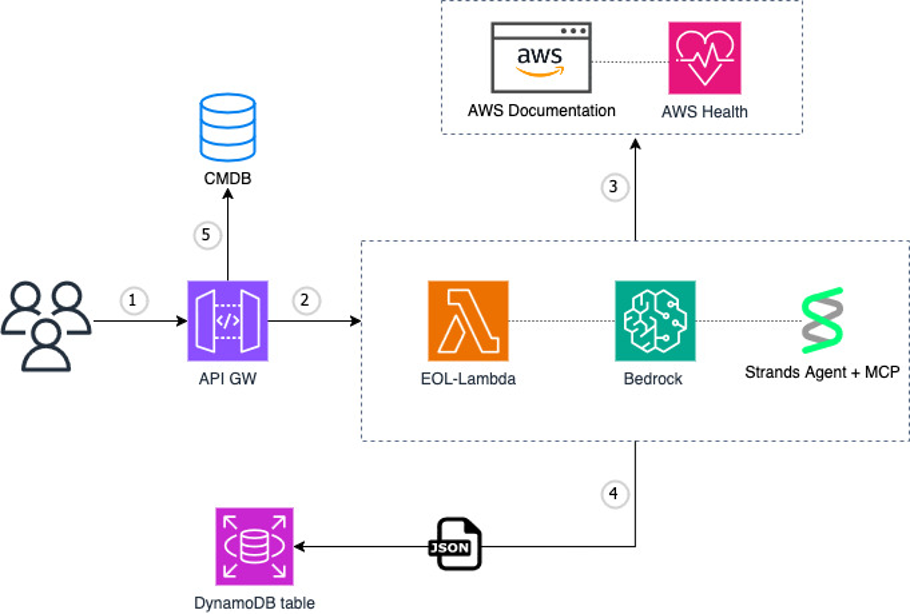

# EOL Tracker

## Introduction

The EOL Tracker is an AWS-based solution that automatically extracts and tracks End-of-Life (EOL) information for AWS services using Amazon Bedrock agents with Model Context Protocol (MCP) integration. The system crawls AWS documentation, extracts EOL data, stores it in DynamoDB, and provides a REST API for querying the information.

**NEW: Multi-Model Support** - The system now supports running EOL extraction with multiple AI models simultaneously, allowing you to compare results across different models and improve accuracy through consensus.

The solution leverages:
- **Amazon Bedrock** with multiple AI models (Anthropic Claude, Amazon Nova...) for intelligent document analysis
- **Model Context Protocol (MCP)** for AWS documentation access
- **AWS Step Functions** for orchestrating multi-model data extraction workflows
- **DynamoDB** with composite keys for storing model-specific EOL data
- **API Gateway + CloudFront** for secure API access
- **EventBridge Scheduler** for automated monthly updates



## ⚠️ Important Disclaimer

**AI-Generated Results:** This system uses AI (Amazon Bedrock with multiple models) to extract and analyze End-of-Life information from AWS documentation. Please note that:

- **Results are non-deterministic by nature** - The same input may produce slightly different outputs across runs and models
- **Manual verification is required** - All extracted EOL data should be validated against official AWS documentation before use in production environments
- **Multi-model consensus** - Using multiple models can improve accuracy by allowing comparison and validation across different AI models
- **Continuous improvement** - We are actively developing enhancements to make the results more deterministic and reliable

Always cross-reference the generated EOL information with the official AWS service documentation before making critical business or technical decisions.

## Multi-Model Support Benefits

The multi-model feature allows you to:

1. **Compare Results Across Models** - Run the same extraction with different AI models and compare outputs
2. **Improve Accuracy** - Identify consensus across models to increase confidence in results
3. **Model Performance Analysis** - Evaluate which models perform best for specific AWS services
4. **Redundancy** - If one model fails or produces poor results, you have alternatives
5. **Cost Optimization** - Choose cost-effective models for bulk processing while using premium models for validation
6. **Automatic Best Record Selection** - The system calculates accuracy scores and returns the most reliable result

**Supported Model Formats:**
- Standard Bedrock models: `anthropic.claude-3-7-sonnet-20250219-v1:0`
- Cross-region inference: `us.anthropic.claude-sonnet-4-20250514-v1:0`
- Multiple providers: Anthropic, Amazon, Meta, OpenAI, Qwen

## Accuracy Scoring System

The system automatically calculates an accuracy score (0.0-1.0) for each EOL record to identify the most reliable results when multiple models provide different information for the same service-cycle combination.

### Scoring Formula

```
accuracy_score = (0.40 × consensus) + (0.25 × completeness) + 
                 (0.20 × date_validity) + (0.15 × model_tier)
```

### Component Scores

#### 1. Consensus Score (40% weight)

Measures agreement with other models for the same service-cycle:

- **Calculation:** Percentage of fields that match across all models
- **Range:** 0.0 (no agreement) to 1.0 (complete agreement)
- **Example:** If 4 out of 5 comparable fields match across models → 0.80
- **First model:** Returns 0.5 (neutral) when no peer models exist yet

**Comparable Fields:** `lts`, `releaseDate`, `supportEndDate`, `eol`, `latest`, `link`

#### 2. Completeness Score (25% weight)

Measures data completeness:

- **Calculation:** Percentage of non-null scoreable fields
- **Range:** 0.0 (all null) to 1.0 (all populated)
- **Example:** If 5 out of 6 scoreable fields are populated → 0.83

**Scoreable Fields:** `lts`, `releaseDate`, `supportEndDate`, `eol`, `latest`, `link`

#### 3. Date Validity Score (20% weight)

Validates date field quality:

- **Checks:**
  - Valid ISO 8601 format (YYYY-MM-DD)
  - Dates within reasonable range (1990-2050)
  - Logical consistency (EOL date > release date)
- **Range:** 0.0 (all invalid) to 1.0 (all valid)
- **Example:** All 3 date fields valid and consistent → 1.0

#### 4. Model Tier Score (15% weight)

Reflects model capability level:

- **Premium Models (1.0):** Claude Sonnet 4, Claude Sonnet 4.5, Claude 3.7 Sonnet
- **Mid-Tier Models (0.5):** Amazon Nova Premier
- **Standard Models (0.2):** Other models
- **Example:** Claude Sonnet 4 → 1.0

### Example Score Calculation

**Scenario:** Amazon EKS 1.30 extracted by Claude Sonnet 4

**Record Data:**
- All 6 scoreable fields populated
- 4 out of 5 fields match with Nova Premier's result
- All dates valid and consistent
- Premium model (Claude Sonnet 4)

**Calculation:**
```
consensus_score = 0.80 (4/5 fields match)
completeness_score = 1.0 (6/6 fields populated)
date_validity_score = 1.0 (all dates valid)
model_tier_score = 1.0 (premium model)

accuracy_score = (0.40 × 0.80) + (0.25 × 1.0) + (0.20 × 1.0) + (0.15 × 1.0)
               = 0.32 + 0.25 + 0.20 + 0.15
               = 0.92 (Highly reliable)
```

### Best Record Selection

When multiple models provide results for the same service-cycle, the API returns only the highest-scoring record using this logic:

1. **Primary:** Highest `accuracy_score`
2. **Tie-breaker 1:** Model tier (Premium > Mid-tier > Standard)
3. **Tie-breaker 2:** Most recent `lastUpdated` timestamp

**Example:**

Three models extract Amazon RDS MySQL 8.0:
- Claude Sonnet 4: accuracy_score = 0.89
- Nova Premier: accuracy_score = 0.75
- Claude 3.7 Sonnet: accuracy_score = 0.82

**Result:** API returns Claude Sonnet 4's record (highest score)

### Retroactive Recalculation

**Important:** Accuracy scores are automatically recalculated at the end of each Step Function execution to ensure fairness across all models.

**Why this matters:**
- When the first model processes a service-cycle, it has no peers to compare against (consensus = 0.5)
- When later models run, they can compare against earlier models (consensus = 0.8+)
- Without recalculation, the first model would be unfairly penalized

**How it works:**
1. All models complete their processing
2. `RecalculateAccuracyScoresFunction` runs automatically
3. Scans all records and groups by service-cycle
4. Recalculates each record's accuracy score with full peer data
5. Updates only records where the score changed

**Result:** All models are evaluated fairly with the same peer comparison data, ensuring the "best record" selection is truly accurate.

### Improving Accuracy Scores

To get higher accuracy scores:

1. **Run multiple models** - Increases consensus scores through retroactive recalculation
2. **Use premium models** - Higher model tier scores (1.0 vs 0.5 or 0.2)
3. **Ensure complete data** - Populate all optional fields
4. **Validate dates** - Use ISO 8601 format and logical consistency
5. **Re-run periodically** - Monthly execution keeps data fresh

### Monitoring Accuracy

Track accuracy score distribution:

```bash
# Get average accuracy score by model
aws dynamodb scan --table-name EOLTrackerDB --region us-east-1 \
  | jq '.Items | group_by(.model_name.S) | map({
      model: .[0].model_name.S,
      count: length,
      avg_score: (map(.accuracy_score.N | tonumber) | add / length),
      min_score: (map(.accuracy_score.N | tonumber) | min),
      max_score: (map(.accuracy_score.N | tonumber) | max)
    })'
```

## Architecture Components

- **Lambda Functions**:
  - `EOLMcpAgentFunction`: Extracts EOL data from AWS documentation using MCP
  - `EOLDataImportFunction`: Imports extracted data into DynamoDB with accuracy scoring
  - `EOLDataQueryFunction`: Provides API endpoint for querying EOL data
  - `RecalculateAccuracyScoresFunction`: Recalculates accuracy scores after all models complete
  - `CustomAuthorizerFunction`: Handles API authentication
  - `LoadConfigFunction`: Loads service configuration for processing
- **VPC Configuration**:
  - Private subnets for Lambda functions
  - NAT Gateway for internet access (AWS documentation)
  - VPC Endpoints for AWS services (S3, DynamoDB, Bedrock, SQS, Step Functions)
  - Security groups with restricted egress rules
  - VPC Flow Logs for network monitoring
- **Step Functions State Machine**: Orchestrates multi-model sequential execution with nested Map states
- **DynamoDB Table**: Stores EOL information with composite keys (service + cycle_model) and accuracy scores for multi-model support 
- **API Gateway**: REST API with custom authorization and X-Ray tracing
- **CloudFront Distribution**: CDN with WAF protection (includes Log4Shell protection)
- **EventBridge Scheduler**: Triggers monthly data updates
- **Dead Letter Queues**: SQS queues for failed Lambda invocations
- **KMS Encryption**: All logs and data encrypted at rest with key rotation enabled


## Prerequisites

### Required Software

1. **Python 3.12+**
   - Download from: https://www.python.org/downloads/

2. **AWS CLI**
   - Installation guide: https://docs.aws.amazon.com/cli/latest/userguide/getting-started-install.html

3. **AWS SAM CLI**
   - Installation guide: https://docs.aws.amazon.com/serverless-application-model/latest/developerguide/install-sam-cli.html

### AWS Requirements

- AWS Account with appropriate permissions
- Bedrock model access enabled for the models you want to use:
  - **Anthropic Claude** models (recommended: Claude 3.7 Sonnet, Claude Sonnet 4, Claude Sonnet 4.5)
  - **Amazon Nova** models (Nova Pro, Premier)

- S3 bucket for storing Lambda layers and EOL data
- Region: **us-east-1** (required for cross-region inference and latest model availability)

## Deployment Instructions

### Step 1: Clone the Repository

```bash
git clone <repository-url>
cd EOLTracker
```

### Step 2: Configure AWS Credentials

Configure your AWS credentials before proceeding:

```bash
aws configure
```

Provide your:
- AWS Access Key ID
- AWS Secret Access Key
- Default region (us-east-1 or us-west-2)
- Default output format (json)

### Step 3: Build Lambda Layer

The Lambda layer contains all dependencies for the MCP agent including the `uv` package manager and required Python libraries.
Before you launch the below commands, you need to create an S3 bucket manually to store the layer.

```bash
cd cfn-templates/build-layer
chmod +x ./build-layer.sh
./build-layer.sh --s3-bucket <your-s3-bucket-name>
```

This script will:
- Install `uv` package manager
- Package all dependencies
- Upload the layer to your S3 bucket at `s3://<bucket>/layers/eol_mcp_layer.zip`

### Step 4: Deploy CloudFormation Stack

Ensure your AWS credentials are configured, then navigate to the CloudFormation templates directory and deploy using SAM:

```bash
cd ../
sam deploy --guided \
  --stack-name EOLTracker \
  --region us-east-1 \
  --capabilities CAPABILITY_NAMED_IAM \
  --parameter-overrides \
    S3BucketName=<your-s3-bucket-name> \
    Region=us-east-1 \
  --template ./EOLTrackerTemplate.yml
```


During the guided deployment, you'll be prompted for:
- Stack name (default: EOLTracker)
- AWS Region (us-east-1 or us-west-2)
- S3 bucket name for storing data
- Confirmation to create IAM roles


### Step 5: Get API Endpoint

After successful deployment, retrieve the API URL from the CloudFormation outputs:

```bash
aws cloudformation describe-stacks \
  --stack-name EOLTracker \
  --query "Stacks[0].Outputs[?OutputKey=='ApiUrl'].OutputValue" \
  --output text
```

## Usage

### Install awscurl

Install awscurl to query the API with AWS Signature Version 4 authentication:

```bash
pip install awscurl
```

### Query EOL Data

Use awscurl to query EOL information for AWS services:

```bash
# Query best record for a service (highest accuracy score)
awscurl --service execute-api \
  "https://<api-gateway-id>.execute-api.us-east-1.amazonaws.com/dev/eol?service=Amazon%20EKS"

# Query specific model results
awscurl --service execute-api \
  "https://<api-gateway-id>.execute-api.us-east-1.amazonaws.com/dev/eol?service=Amazon%20EKS&model=us.anthropic.claude-sonnet-4-20250514-v1:0"

# Query specific service-cycle (returns best model result)
awscurl --service execute-api \
  "https://<api-gateway-id>.execute-api.us-east-1.amazonaws.com/dev/eol?service=Amazon%20EKS&cycle=1.30"

# Query all services (returns best record for each service-cycle)
awscurl --service execute-api \
  "https://<api-gateway-id>.execute-api.us-east-1.amazonaws.com/dev/eol"
```

**Query Parameters:**
- `service` (optional): The AWS service name (e.g., "Amazon EKS", "AWS Lambda")
- `cycle` (optional): Filter by specific version/cycle
- `model` (optional): Filter results by specific model identifier

**Query Behavior:**

| Query Type | Parameters | Returns |
|------------|------------|---------|
| All services | None | Best record for each service-cycle across all services |
| Service only | `service=Amazon EKS` | Best record for each cycle of Amazon EKS |
| Service + Cycle | `service=Amazon EKS&cycle=1.30` | Best record for Amazon EKS 1.30 (highest accuracy) |
| Service + Model | `service=Amazon EKS&model=<model-id>` | All records from specified model for Amazon EKS |
| Service + Cycle + Model | `service=Amazon EKS&cycle=1.30&model=<model-id>` | Specific record from one model |

**Best Record Selection:**

By default, the API returns only the highest accuracy score record for each service-cycle combination. The selection process:

1. **Primary criterion:** Highest `accuracy_score` (0.0-1.0)
2. **Tie-breaker 1:** Model tier (Premium > Mid-tier > Standard)
3. **Tie-breaker 2:** Most recent `lastUpdated` timestamp

**Example Response:**

```json
[
  {
    "service": "Amazon EKS",
    "cycle": "1.30",
    "cycle_model": "1.30#us.anthropic.claude-sonnet-4-20250514-v1:0",
    "model_name": "us.anthropic.claude-sonnet-4-20250514-v1:0",
    "accuracy_score": 0.92,
    "lts": true,
    "releaseDate": "2024-05-15",
    "supportEndDate": "2025-11-15",
    "eol": "2026-05-15",
    "latest": "1.30.5",
    "link": "https://docs.aws.amazon.com/eks/latest/userguide/kubernetes-versions.html",
    "lastUpdated": "2025-01-15T10:30:00Z"
  }
]
```

**Understanding Accuracy Scores:**

| Score Range | Interpretation | Recommendation |
|-------------|----------------|----------------|
| 0.90 - 1.00 | Highly reliable | Use with confidence |
| 0.75 - 0.89 | Reliable | Generally trustworthy |
| 0.60 - 0.74 | Moderate reliability | Verify critical fields |
| 0.40 - 0.59 | Low reliability | Manual verification recommended |
| 0.00 - 0.39 | Very low reliability | Do not use without verification |

**Note:** Each record includes an `accuracy_score` field (0.0-1.0) indicating reliability based on consensus with other models, data completeness, date validity, and model tier. 

### Advanced Query Examples

#### Compare Multiple Models

To see results from all models for a specific service-cycle (useful for debugging or analysis):

```bash
# Query DynamoDB directly to see all model results
aws dynamodb query \
  --table-name EOLTrackerDB \
  --key-condition-expression "service = :service AND begins_with(cycle_model, :cycle)" \
  --expression-attribute-values '{":service":{"S":"Amazon EKS"},":cycle":{"S":"1.30#"}}' \
  --region us-east-1
```

#### Filter by Accuracy Threshold

To get only high-confidence results (requires custom filtering):

```bash
# Query and filter locally
awscurl --service execute-api \
  "https://<api-id>.execute-api.us-east-1.amazonaws.com/dev/eol?service=Amazon%20EKS" \
  | jq '.[] | select(.accuracy_score >= 0.80)'
```

#### Get Model Performance Statistics

```bash
# Query all records and analyze by model
aws dynamodb scan --table-name EOLTrackerDB --region us-east-1 \
  | jq '.Items | group_by(.model_name.S) | map({model: .[0].model_name.S, count: length, avg_score: (map(.accuracy_score.N | tonumber) | add / length)})'
```


### View Stored Data

Access DynamoDB to view the extracted EOL data:


### Manual Trigger

To manually trigger the EOL data extraction workflow:

```bash
aws stepfunctions start-execution \
  --state-machine-arn arn:aws:states:<region>:<account-id>:stateMachine:EOLDataProcessingStateMachine \
  --input '{"manualExecution": true}'
```

### Scheduled Execution

By default, the system runs automatically on the 1st of every month at 3 AM UTC. You can modify the schedule by updating the `ScheduleExpression` parameter in the CloudFormation template.

## Configuration

### Multi-Model Configuration

Edit `cfn-templates/src/cfg/EOLTracker_config.json` to configure models and services:

```json
{
  "models": [
    "us.anthropic.claude-sonnet-4-20250514-v1:0",
    "us.amazon.nova-premier-v1:0",
    "anthropic.claude-3-7-sonnet-20250219-v1:0"
  ],
  "services": [
    {
      "service_name": "Amazon EKS",
      "service_url": "https://docs.aws.amazon.com/eks/latest/userguide/kubernetes-versions.html",
      "description": "Kubernetes versions and EOL information for Amazon EKS"
    },
    {
      "service_name": "AWS Lambda",
      "service_url": "https://docs.aws.amazon.com/lambda/latest/dg/lambda-runtimes.html",
      "description": "Lambda runtimes and EOL information"
    }
  ]
}
```

**Configuration Fields:**
- `models`: Array of Bedrock model identifiers to use for extraction (supports both standard and cross-region formats)
- `services`: Array of AWS services to track with their documentation URLs

**Model Identifier Formats:**
- Standard Bedrock: `anthropic.claude-3-7-sonnet-20250219-v1:0`
- Cross-region inference: `us.anthropic.claude-sonnet-4-20250514-v1:0`
- Pattern: `provider.model-name-version:variant`

**How Multi-Model Processing Works:**
1. The system processes each model sequentially
2. For each model, it processes all configured services
3. Each record is assigned an accuracy score (0.0-1.0) based on consensus, completeness, date validity, and model tier
4. Results are stored in DynamoDB with a composite key: `service` (partition key) and `cycle_model` (sort key)
5. The `cycle_model` format is: `{cycle}#{model_id}` (e.g., `1.30#us.anthropic.claude-sonnet-4-20250514-v1:0`)
6. API queries automatically return the highest-scoring record for each service-cycle combination
7. This allows querying and comparing results across different models for the same service/cycle

For detailed schema information and query patterns, see [DynamoDB Schema Documentation](cfn-templates/DYNAMODB_SCHEMA.md).

### Configuration File Migration

**IMPORTANT:** If you're upgrading from a previous version, you need to migrate your configuration file:

**Old Format (aws_services.json):**
```json
[
  {
    "service_name": "Amazon RDS",
    "service_url": "https://...",
    "description": "..."
  }
]
```

**New Format (EOLTracker_config.json):**
```json
{
  "models": ["us.anthropic.claude-sonnet-4-20250514-v1:0"],
  "services": [
    {
      "service_name": "Amazon RDS",
      "service_url": "https://...",
      "description": "..."
    }
  ]
}
```

**Migration Steps:**
1. Rename `cfn-templates/src/cfg/aws_services.json` to `EOLTracker_config.json`
2. Wrap the services array in an object with `services` key
3. Add a `models` array with at least one model identifier
4. Redeploy the CloudFormation stack

**Default Behavior:** If the `models` field is missing, the system uses a default model list.

### Adjust Schedule

Modify the `ScheduleExpression` parameter in the CloudFormation template:

```yaml
Parameters:
  ScheduleExpression:
    Type: String
    Default: "cron(0 3 1 * ? *)"  # 1st of month at 3 AM UTC
```

## Cost Estimation

Estimated monthly costs for running the EOL Tracker (based on us-east-1 pricing):

### Monthly Scheduled Execution (Default: Once per month)

| Service | Usage | Estimated Cost |
|---------|-------|----------------|
| **Amazon Bedrock** | Multi-model processing (5 models × 10 services × ~50K input tokens, ~5K output tokens per run) | ~$1.50-3.00/month |
| **Lambda - EOLMcpAgentFunction** | 1 execution × 15 min × 2048 MB | ~$0.05/month |
| **Lambda - EOLDataImportFunction** | 1 execution × 5 min × 128 MB | ~$0.01/month |
| **Lambda - EOLDataQueryFunction** | 100 API queries × 1 sec × 128 MB | ~$0.01/month |
| **Lambda - CustomAuthorizerFunction** | 100 authorizations × 1 sec × 128 MB | ~$0.01/month |
| **Lambda - LoadConfigFunction** | 1 execution × 1 sec × 128 MB | <$0.01/month |
| **VPC NAT Gateway** | 730 hours + minimal data processing | ~$33.00/month |
| **VPC Endpoints (Interface)** | 3 endpoints × 730 hours (Bedrock, SQS, Step Functions) | ~$21.60/month |
| **VPC Endpoints (Gateway)** | S3 and DynamoDB | Free |
| **Elastic IP** | 1 EIP for NAT Gateway | Free (in use) |
| **SQS Dead Letter Queues** | Minimal usage for failed invocations | <$0.01/month |
| **Step Functions** | 1 execution × 2 state transitions | <$0.01/month |
| **DynamoDB** | On-demand, ~100 items, minimal reads/writes | ~$0.25/month |
| **API Gateway** | 100 requests | <$0.01/month |
| **CloudFront** | 100 requests, minimal data transfer | <$0.01/month |
| **S3** | Storage for Lambda layer (~50 MB) and EOL data (~1 MB) | <$0.01/month |
| **CloudWatch Logs** | ~500 MB logs with 7-14 day retention | ~$0.25/month |
| **EventBridge Scheduler** | 1 scheduled execution | <$0.01/month |
| **KMS** | Key storage and API calls | ~$1.00/month |
| **WAF** | Web ACL with basic rules | ~$5.00/month |

**Total Estimated Cost: ~$61-62 USD/month**

### Cost Optimization Tips

#### ⚠️ Recommended: Delete Stack After Each Use

**IMPORTANT:** To minimize costs, it is **strongly recommended** to delete the CloudFormation stack after each usage, especially if you only need to run the EOL extraction occasionally.

**Why?** The majority of costs (~90%) come from resources that charge hourly:
- **NAT Gateway**: ~$33/month (~$0.045/hour) - charges even when idle
- **Interface VPC Endpoints**: ~$21.60/month (~$0.01/hour per endpoint) - 3 endpoints charging continuously

These resources accumulate costs 24/7 regardless of whether the system is actively processing data.

**Workflow for Cost Savings:**

1. **Deploy stack when needed:**
   ```bash
   sam deploy --guided --stack-name EOLTracker
   ```

2. **Run the EOL extraction:**
   ```bash
   aws stepfunctions start-execution \
     --state-machine-arn arn:aws:states:<region>:<account-id>:stateMachine:EOLDataProcessingStateMachine \
     --input '{"manualExecution": true}'
   ```

3. **Export DynamoDB data (optional):**
   ```bash
   aws dynamodb scan --table-name EOLTrackerDB > eol-data-backup.json
   ```

4. **Delete stack immediately after use:**
   ```bash
   aws cloudformation delete-stack --stack-name EOLTracker
   ```

**Cost Comparison:**
- **Keeping stack running 24/7**: ~$61-62/month
- **Deploy → Run → Delete (once per month)**: ~$2-3/execution
- **Annual savings**: ~$700/year

#### Other Optimization Options

- **Remove VPC configuration** if security isolation is not required (saves ~$55/month from NAT Gateway and Interface Endpoints)
- **Remove WAF** if not required for your use case (saves ~$5/month)
- **Reduce Lambda memory** for EOLMcpAgentFunction if processing fewer services
- **Adjust log retention** to 3-5 days instead of 7-14 days
- **Use S3 Intelligent-Tiering** for long-term data storage
- **Disable CloudFront** if you don't need CDN capabilities (use API Gateway directly)
- **Consider removing Interface VPC Endpoints** and use NAT Gateway for all traffic (saves ~$22/month but increases data transfer costs)
- **Disable EventBridge Scheduler** if you prefer manual execution only

**Note:** Costs may vary based on:
- Number of AWS services tracked
- API query volume
- Bedrock model token usage
- Data transfer and storage growth

For detailed cost estimates, use the [AWS Pricing Calculator](https://calculator.aws).

## Deployment Checklist

Use this checklist to ensure a successful deployment:

### Pre-Deployment

- [ ] AWS CLI installed and configured
- [ ] AWS SAM CLI installed
- [ ] Python 3.12+ installed
- [ ] S3 bucket created for Lambda layers
- [ ] Bedrock model access enabled for all models in configuration
- [ ] Region set to us-east-1 (recommended for latest models)
- [ ] IAM permissions verified (CloudFormation, Lambda, DynamoDB, S3, Bedrock, VPC)

### Configuration

- [ ] Configuration file created at `cfn-templates/src/cfg/EOLTracker_config.json`
- [ ] Models array populated with valid Bedrock model identifiers
- [ ] Services array populated with AWS services to track
- [ ] Model identifiers validated (format: `provider.model-name-version:variant`)
- [ ] Service URLs verified and accessible

### Build and Deploy

- [ ] Lambda layer built successfully: `./build-layer.sh --s3-bucket <bucket>`
- [ ] Layer uploaded to S3: `s3://<bucket>/layers/eol_mcp_layer.zip`
- [ ] CloudFormation stack deployed: `sam deploy --guided`
- [ ] Stack creation completed without errors
- [ ] All resources created successfully (check CloudFormation console)

### Post-Deployment Verification

- [ ] API Gateway endpoint retrieved from CloudFormation outputs
- [ ] Test query executed successfully with awscurl
- [ ] DynamoDB table created with correct schema
- [ ] Step Functions state machine created
- [ ] Lambda functions deployed and accessible
- [ ] CloudWatch Log Groups created
- [ ] VPC and networking resources created (if applicable)

### First Execution

- [ ] Manual Step Functions execution triggered
- [ ] Execution completes successfully (may take several hours for multiple models)
- [ ] CloudWatch Logs show no critical errors
- [ ] DynamoDB records created with accuracy scores
- [ ] API returns expected results
- [ ] Accuracy scores within expected range (0.0-1.0)

### Monitoring Setup

- [ ] CloudWatch alarms configured (optional)
- [ ] Log retention periods set appropriately
- [ ] Cost monitoring enabled
- [ ] EventBridge Scheduler verified (monthly execution)

### Migration (If Upgrading)

- [ ] Backup of existing DynamoDB data created
- [ ] Migration script tested with `--dry-run`
- [ ] Migration script executed successfully
- [ ] Migration validation completed
- [ ] Old configuration file migrated to new format
- [ ] API backward compatibility verified

## Uninstall and Rollback

### Complete Uninstall

To remove all resources:

```bash
# Delete CloudFormation stack
aws cloudformation delete-stack --stack-name EOLTracker --region us-east-1

# Wait for deletion to complete
aws cloudformation wait stack-delete-complete --stack-name EOLTracker --region us-east-1

# Manually delete S3 bucket contents (if needed)
aws s3 rm s3://<your-bucket>/layers/ --recursive
aws s3 rm s3://<your-bucket>/eol_results/ --recursive

# Delete DynamoDB backups (optional)
aws dynamodb list-backups --table-name EOLTrackerDB --region us-east-1
aws dynamodb delete-backup --backup-arn <backup-arn> --region us-east-1
```

**Note:** CloudFormation will automatically delete most resources, but you may need to manually delete:
- S3 bucket contents (buckets with objects cannot be auto-deleted)
- DynamoDB backups (if you want to remove them)
- CloudWatch Log Groups (if retention is set to "Never Expire")

### Rollback After Failed Deployment

If deployment fails or causes issues:

#### Option 1: Automatic Rollback

CloudFormation automatically rolls back on deployment failure. Check the CloudFormation console for error details.

#### Option 2: Manual Rollback to Previous Version

```bash
# Update stack to previous template version
aws cloudformation update-stack \
  --stack-name EOLTracker \
  --use-previous-template \
  --region us-east-1 \
  --capabilities CAPABILITY_NAMED_IAM

# Or delete and redeploy from previous version
aws cloudformation delete-stack --stack-name EOLTracker --region us-east-1
# Wait for deletion, then redeploy from previous template
```

#### Option 3: Rollback DynamoDB Data

If data migration causes issues:

```bash
# List available backups
aws dynamodb list-backups \
  --table-name EOLTrackerDB \
  --region us-east-1

# Restore from backup
aws dynamodb restore-table-from-backup \
  --target-table-name EOLTrackerDB-restored \
  --backup-arn <backup-arn> \
  --region us-east-1

# After verification, swap tables
# (Requires deleting old table and renaming restored table)
```

### Rollback Checklist

- [ ] Identify the issue (deployment failure, data corruption, performance problems)
- [ ] Create backup of current state (if not already done)
- [ ] Choose rollback method (automatic, manual, or data-only)
- [ ] Execute rollback procedure
- [ ] Verify system functionality after rollback
- [ ] Check API queries return expected results
- [ ] Verify DynamoDB data integrity
- [ ] Review CloudWatch Logs for errors
- [ ] Document the issue and rollback process

### Partial Uninstall (Cost Optimization)

To reduce costs while keeping data:

```bash

# Delete the entire stack and keep only DynamoDB data
aws cloudformation delete-stack --stack-name EOLTracker --region us-east-1
# DynamoDB table will be deleted, but backups remain for 35 days (if PITR enabled)
```

### Data Export Before Uninstall

To preserve data before uninstalling:

```bash
# Export all DynamoDB data
aws dynamodb scan --table-name EOLTrackerDB --region us-east-1 > eol-data-export.json

# Export to CSV (requires jq)
aws dynamodb scan --table-name EOLTrackerDB --region us-east-1 \
  | jq -r '.Items[] | [.service.S, .cycle.S, .model_name.S, .accuracy_score.N, .eol.S] | @csv' \
  > eol-data-export.csv

# Create DynamoDB backup
aws dynamodb create-backup \
  --table-name EOLTrackerDB \
  --backup-name EOLTrackerDB-final-backup-$(date +%Y%m%d) \
  --region us-east-1
```

## Troubleshooting

### Lambda Timeout Issues
- Increase the `Timeout` parameter for `EOLMcpAgentFunction` (default: 900 seconds)
- Check CloudWatch Logs for detailed error messages
- Multi-model processing takes longer - consider reducing the number of models if timeouts occur
- Monitor Step Functions execution time - with 5 models and 10 services, expect ~12.5 hours total

### MCP Connection Errors
- Verify the Lambda layer was built and uploaded correctly
- Check that `/tmp` directory has sufficient space
- Review environment variables in the Lambda function
- Ensure `uv` package manager is properly installed in the Lambda layer

### Model Access Errors
- Verify you have enabled access to all models in your configuration
- Check that model identifiers are correctly formatted (supports both standard and cross-region formats)
- Review Bedrock model access in the AWS console (Bedrock → Model access)
- Ensure you're using the correct region (us-east-1 recommended for latest models)
- Check IAM permissions for Bedrock model invocation

**Common Model Access Issues:**

```bash
# Check which models you have access to
aws bedrock list-foundation-models --region us-east-1 \
  | jq '.modelSummaries[] | {modelId: .modelId, status: .modelLifecycle.status}'

# Request access to a model (via console)
# Navigate to: Bedrock → Model access → Manage model access
```

### Configuration File Errors

#### Invalid Model Identifier Format

**Error:** `Invalid model identifier format`

**Solution:** Ensure model IDs follow the pattern: `provider.model-name-version:variant`

Valid examples:
- `anthropic.claude-3-7-sonnet-20250219-v1:0`
- `us.anthropic.claude-sonnet-4-20250514-v1:0`
- `amazon.nova-premier-v1:0`

#### Missing Models Field

**Error:** `Configuration missing models field`

**Solution:** The system will use default models, but you should add a `models` array to your configuration:

```json
{
  "models": ["us.anthropic.claude-sonnet-4-20250514-v1:0"],
  "services": [...]
}
```

### DynamoDB Validation Errors

#### Missing Required Fields

**Error:** `Missing the key service in the item`

**Solution:** Ensure your configuration file has valid service names and the EOL extraction returned valid data.

#### Composite Key Errors

**Error:** `Cycle cannot contain '#' character`

**Solution:** The '#' character is reserved for the composite key separator. Clean your data to remove or replace '#' characters.

### Accuracy Score Issues

#### Unexpected Low Scores

**Symptom:** All records have accuracy scores below 0.5

**Possible Causes:**
1. **First model run:** No peer records for consensus (expected)
2. **Incomplete data:** Many null fields reduce completeness score
3. **Invalid dates:** Date validation failures reduce date validity score

**Solution:**
- Run multiple models to improve consensus scores
- Verify date fields are in ISO 8601 format
- Check that EOL dates are after release dates

#### Scores Not Updating

**Symptom:** Accuracy scores remain the same after adding new models

**Solution:**
- Accuracy scores are calculated at import time
- Re-run the Step Functions workflow to recalculate scores with new peer data
- Existing records won't automatically update when new models are added

### API Query Issues

#### No Results Returned

**Symptom:** API returns empty array `[]`

**Possible Causes:**
1. Service name doesn't match exactly (case-sensitive)
2. No data exists for the specified service
3. Model filter excludes all results

**Solution:**
```bash
# List all services in the database
aws dynamodb scan --table-name EOLTrackerDB --region us-east-1 \
  | jq '.Items[].service.S' | sort -u

# Query without filters
awscurl --service execute-api \
  "https://<api-id>.execute-api.us-east-1.amazonaws.com/dev/eol"
```

#### Wrong Record Returned

**Symptom:** API returns a record with lower accuracy score than expected

**Possible Causes:**
1. Tie-breaking by model tier or timestamp
2. Other records have even lower scores
3. Filtering by model parameter

**Solution:**
- Query DynamoDB directly to see all model results
- Check accuracy scores of all records for that service-cycle
- Verify model tier priorities in the code

### API Authorization Failures

**Error:** `User is not authorized to access this resource`

**Solution:**
- Verify the custom authorizer is configured correctly
- Check CloudWatch Logs for `CustomAuthorizerFunction`
- Ensure you're using AWS Signature Version 4 authentication with awscurl
- Verify IAM user/role has `execute-api:Invoke` permission

### Step Functions Execution Failures

#### Workflow Stops After First Model

**Symptom:** Step Functions processes only one model instead of all configured models

**Solution:**
- Check Step Functions execution history for errors
- Verify the outer Map state is configured correctly
- Review CloudWatch Logs for `LoadConfigFunction` to ensure models array is loaded

#### Individual Service Failures

**Symptom:** Some services fail while others succeed

**Solution:**
- Failed model extractions are logged but don't stop the entire workflow (by design)
- Check CloudWatch Logs for specific error messages
- Review the service URL in configuration - ensure it's accessible
- Check if the model has rate limits or throttling

#### All Services Fail for a Model

**Symptom:** All services fail for a specific model but succeed for others

**Possible Causes:**
1. Model not available in the region
2. Model access not enabled
3. Model-specific rate limits exceeded

**Solution:**
```bash
# Check Step Functions execution details
aws stepfunctions describe-execution \
  --execution-arn <execution-arn> \
  --region us-east-1

# Review error logs
aws logs tail /aws/lambda/EOLMcpAgentFunction --follow --region us-east-1
```
### Performance Issues

#### Slow Query Response

**Symptom:** API queries take several seconds to respond

**Possible Causes:**
1. Large result set requiring filtering
2. DynamoDB throttling
3. Cold start of Lambda function

**Solution:**
- Use specific query parameters (service, cycle) instead of scanning all records
- Consider adding a Global Secondary Index for model_name queries
- Increase Lambda memory allocation for faster processing
- Enable DynamoDB auto-scaling if using provisioned capacity

#### High Costs

**Symptom:** Unexpected AWS bill increases

**Possible Causes:**
1. Multiple models increase Bedrock API costs
2. NAT Gateway and VPC Endpoints charge hourly (~$55/month)
3. Increased DynamoDB storage and throughput

**Solution:**
- Use the deploy → run → delete workflow for occasional use
- Reduce the number of models in configuration
- Remove VPC configuration if security isolation isn't required
- Adjust log retention periods (default: 7-14 days)

### Getting Help

If you encounter issues not covered here:

1. **Check CloudWatch Logs** for detailed error messages:
   - `/aws/lambda/EOLMcpAgentFunction`
   - `/aws/lambda/EOLDataImportFunction`
   - `/aws/lambda/EOLDataQueryFunction`
   - `/aws/lambda/LoadConfigFunction`
   - `/aws/stepfunctions/EOLDataProcessingStateMachine`

2. **Review Step Functions execution history** for workflow errors

3. **Verify configuration** files and environment variables

4. **Test in isolation** - try with a single model and service first

5. **Check AWS service quotas** for Bedrock, Lambda, and DynamoDB

## Monitoring

View logs in CloudWatch Log Groups:
- `/aws/lambda/EOLMcpAgentFunction`
- `/aws/lambda/EOLDataImportFunction`
- `/aws/lambda/EOLDataQueryFunction`
- `/aws/lambda/LoadConfigFunction`
- `/aws/lambda/CustomAuthorizerFunction`
- `/aws/stepfunctions/EOLDataProcessingStateMachine`
- `API-Gateway-Access-Logs-*`

### X-Ray Tracing

API Gateway has X-Ray tracing enabled for request analysis and debugging. View traces in the AWS X-Ray console.

## Security

- **Network Isolation**: Lambda functions deployed in private VPC subnets
- **VPC Endpoints**: Private connectivity to AWS services (S3, DynamoDB, Bedrock, SQS, Step Functions)
- **Security Groups**: Restricted egress rules (HTTPS only to VPC CIDR and internet)
- **NAT Gateway**: Controlled internet access for AWS documentation retrieval
- **VPC Flow Logs**: Network traffic monitoring and analysis
- **Encryption at Rest**: All data encrypted using AWS KMS with key rotation enabled
- **API Security**: Custom authorizer with AWS Signature Version 4 authentication
- **CloudFront + WAF**: Protection with AWS Managed Rules (includes Log4Shell/CVE-2021-44228 protection)
- **IAM Best Practices**: Least privilege managed policies (no inline policies)
- **CloudWatch Logs**: Encrypted with KMS, 7-14 day retention
- **Dead Letter Queues**: SQS queues with encryption for failed Lambda invocations
- **S3 Security**: Bucket encryption, versioning, and access logging enabled
- **X-Ray Tracing**: Request analysis and debugging for API Gateway

## License

This project is licensed under the MIT-0 License.

## Credits

This project utilizes:
- [AWS Documentation MCP Server](https://github.com/awslabs/aws-documentation-mcp-server)
- Amazon Bedrock with Anthropic Claude
- AWS Serverless Application Model (SAM)
